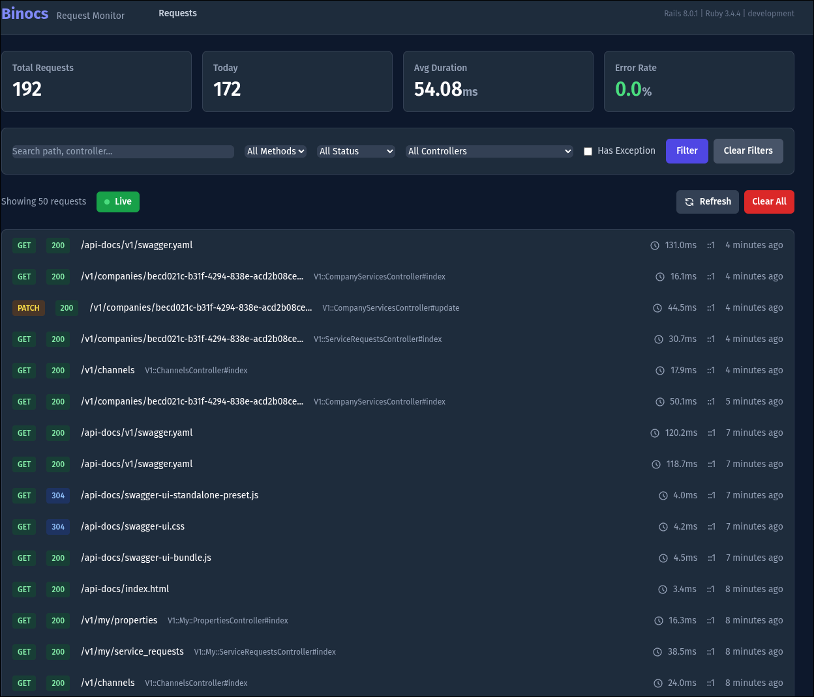
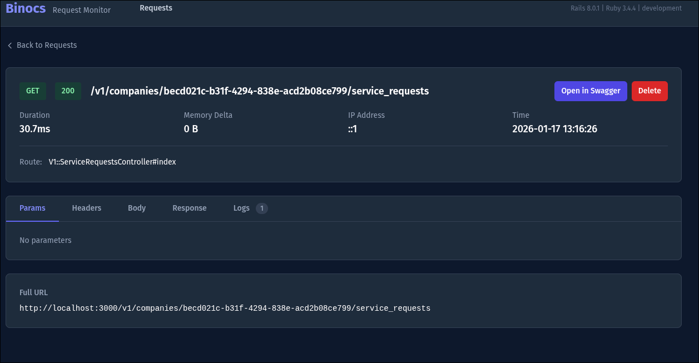
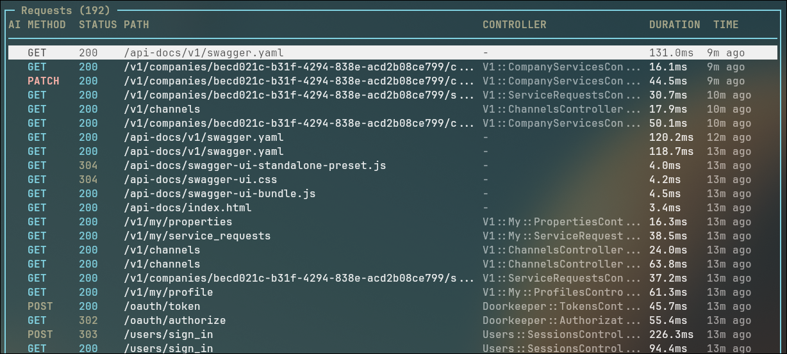
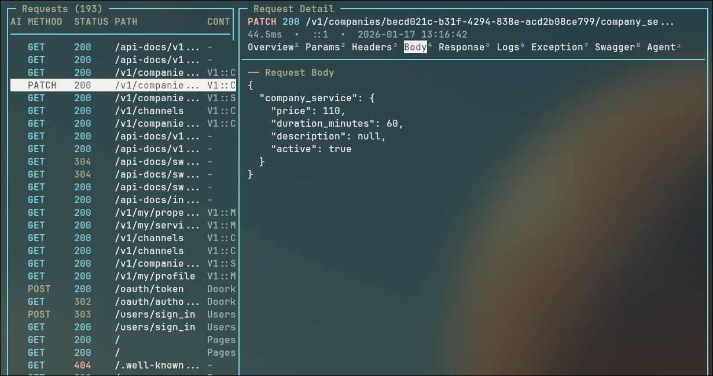
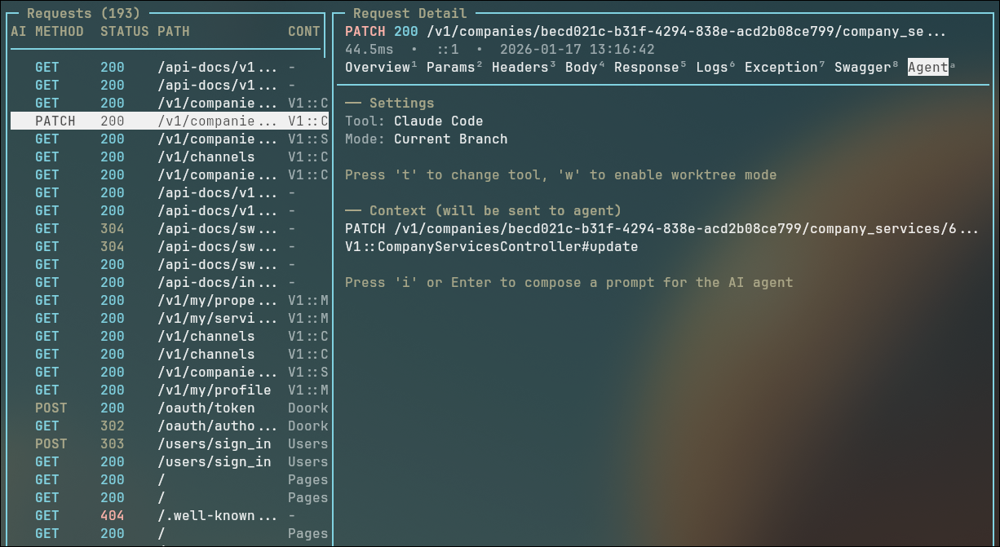

# Binocs

[](https://rubygems.org/gems/binocs)

A Laravel Telescope-inspired request monitoring dashboard for Rails applications. Binocs provides real-time visibility into HTTP requests through both a web interface and a terminal UI with vim-style navigation, making debugging and development easier whether you prefer the browser or the command line.

## Features

- **Real-time Request Monitoring**: Watch requests stream in as they happen via ActionCable/Turbo Streams
- **Comprehensive Request Details**: View params, headers, request/response bodies, logs, and exceptions
- **Powerful Filtering**: Filter by HTTP method, status code, path, controller, and more
- **Exception Tracking**: Quickly identify and debug errors with full backtrace
- **Performance Insights**: Track request duration and memory usage
- **Dark Theme UI**: Beautiful, modern interface built with Tailwind CSS
- **Terminal UI (TUI)**: Vim-style keyboard navigation for console-based monitoring
- **AI Agent Integration**: Launch Claude Code or OpenCode directly from request context to debug issues
- **Swagger Integration**: View OpenAPI documentation for requests and jump to Swagger UI
- **Production Safe**: Automatically disabled in production environments

## Screenshots

### Web Dashboard


*Real-time request monitoring with filtering and status indicators*


*Detailed view showing params, headers, body, logs, and exceptions*

### Terminal UI (TUI)


*Vim-style navigation in your terminal*


*Split-screen detail view with tabbed content*

### AI Agent Integration


*Launch AI coding agents directly from request context*

## Requirements

- Ruby 3.0+
- Rails 7.0+
- ActionCable (for real-time updates)
- ncurses development libraries (for TUI - typically pre-installed on macOS/Linux)

## Installation

### 1. Add Binocs to your Gemfile

```ruby
# Gemfile
gem 'binocs'
```

### 2. Install the gem

```bash
bundle install
```

### 3. Run the install generator

```bash
bin/rails generate binocs:install
```

This will:
- Copy the migration file
- Create an initializer at `config/initializers/binocs.rb`
- Add the route to mount the engine

### 4. Run migrations

```bash
bin/rails db:migrate
```

### 5. Ensure ActionCable is configured

If you haven't set up ActionCable yet, add to your `config/cable.yml`:

```yaml
development:
  adapter: async

test:
  adapter: test

production:
  adapter: redis
  url: <%= ENV.fetch("REDIS_URL") { "redis://localhost:6379/1" } %>
```

### 6. Start your Rails server

```bash
bin/rails server
```

### 7. Visit the dashboard

Open your browser and navigate to: `http://localhost:3000/binocs`

## Configuration

Customize Binocs behavior in `config/initializers/binocs.rb`:

```ruby
Binocs.configure do |config|
  # Enable/disable Binocs (automatically disabled in production)
  config.enabled = true

  # How long to keep request records (default: 24 hours)
  config.retention_period = 24.hours

  # Maximum request/response body size to store (default: 64KB)
  config.max_body_size = 64.kilobytes

  # Paths to ignore (assets, cable, etc.)
  config.ignored_paths = %w[/assets /packs /binocs /cable]

  # Content types to ignore (images, videos, etc.)
  config.ignored_content_types = %w[image/ video/ audio/ font/]

  # Maximum number of requests to store (oldest are deleted)
  config.max_requests = 1000

  # Whether to record request/response bodies
  config.record_request_body = true
  config.record_response_body = true

  # Optional: Protect the dashboard with basic auth
  config.basic_auth_username = ENV['BINOCS_USERNAME']
  config.basic_auth_password = ENV['BINOCS_PASSWORD']

  # Swagger/OpenAPI integration (for TUI)
  config.swagger_spec_url = '/api-docs/v1/swagger.yaml'  # OpenAPI spec endpoint
  config.swagger_ui_url = '/api-docs/index.html'         # Swagger UI URL

  # Devise authentication (recommended if using Devise with ActionCable)
  # config.authentication_method = :authenticate_user!

  # Login path for authentication prompts (auto-detected for Devise)
  # config.login_path = '/users/sign_in'
end
```

### Devise Integration

If your application uses Devise for authentication, you can require users to be logged in before accessing Binocs. This ensures the ActionCable WebSocket connection works properly.

```ruby
# config/initializers/binocs.rb
Binocs.configure do |config|
  # Require Devise authentication (recommended)
  config.authentication_method = :authenticate_user!

  # Or for admin users:
  # config.authentication_method = :authenticate_admin!

  # Or use a custom proc for more control:
  # config.authentication_method = -> { authenticate_user! || authenticate_admin! }
end
```

With this configured, unauthenticated users will be redirected to your login page, then back to `/binocs` after signing in.

**Fallback behavior**: If authentication is not configured but ActionCable requires it, Binocs will detect the WebSocket failure and display a banner prompting users to sign in. You can customize the login path:

```ruby
config.login_path = '/users/sign_in'  # Auto-detected from Devise if not set
```

### Swagger Deep Linking (rswag)

To enable jumping directly to specific endpoints in Swagger UI, add deep linking to your rswag configuration:

```ruby
# config/initializers/rswag_ui.rb
Rswag::Ui.configure do |c|
  c.swagger_endpoint '/api-docs/v1/swagger.yaml', 'API V1 Docs'

  # Enable deep linking to specific operations
  c.config_object['deepLinking'] = true
end
```

With this enabled, pressing `o` in the TUI detail view will open Swagger UI and expand the matching endpoint.

## Usage

### Dashboard Overview

The main dashboard shows a list of all recorded requests with:

- HTTP method (GET, POST, PUT, PATCH, DELETE)
- Status code (color-coded by type)
- Request path
- Controller#action
- Duration
- Timestamp

### Filtering Requests

Use the filter bar to narrow down requests:

- **Search**: Search by path, controller, or action
- **Method**: Filter by HTTP method
- **Status**: Filter by status code range (2xx, 3xx, 4xx, 5xx)
- **Controller**: Filter by controller name
- **Has Exception**: Show only requests with exceptions

### Request Details

Click on any request to see full details including:

- **Overview**: Method, path, status, duration, memory usage
- **Params**: Filtered request parameters
- **Headers**: Request and response headers
- **Body**: Request and response bodies (with JSON formatting)
- **Logs**: Captured log entries from the request
- **Exception**: Full exception details with backtrace (if applicable)

### Real-time Updates

Requests appear in the dashboard in real-time as they're made to your application. The dashboard uses Turbo Streams over ActionCable for instant updates without page refresh.

## How ActionCable Integration Works

Binocs uses Rails' ActionCable and Turbo Streams to provide real-time updates to the dashboard. Here's how the pieces fit together:

### Architecture Overview

```
┌─────────────────┐     ┌─────────────────┐     ┌─────────────────┐
│   Your App      │     │   Binocs        │     │   Dashboard     │
│   Request       │────▶│   Middleware    │────▶│   (Browser)     │
└─────────────────┘     └─────────────────┘     └─────────────────┘
                               │                        ▲
                               │   1. Save to DB        │
                               │   2. Broadcast         │
                               ▼                        │
                        ┌─────────────────┐             │
                        │   Turbo Stream  │─────────────┘
                        │   (ActionCable) │  WebSocket
                        └─────────────────┘
```

### Request Recording Flow

1. **Middleware Intercepts Request**: The `Binocs::Middleware::RequestRecorder` sits in your Rails middleware stack and captures every HTTP request (except ignored paths like `/assets`, `/cable`, etc.)

2. **Data Collection**: For each request, Binocs records:
   - HTTP method, path, full URL
   - Request/response headers and bodies
   - Parameters (filtered for sensitive data)
   - Controller and action names
   - Duration and memory usage
   - Any exceptions that occurred
   - Log entries generated during the request

3. **Database Storage**: The request data is saved to the `binocs_requests` table

4. **Real-time Broadcast**: After saving, Binocs broadcasts the new request via Turbo Streams:
   ```ruby
   Turbo::StreamsChannel.broadcast_prepend_to(
     "binocs_requests",
     target: "requests-list",
     partial: "binocs/requests/request",
     locals: { request: request }
   )
   ```

5. **Dashboard Updates**: The dashboard subscribes to the `binocs_requests` stream via ActionCable. When a broadcast arrives, Turbo automatically prepends the new request to the list.

### ActionCable Connection

The dashboard establishes a WebSocket connection when you load the page:

```erb
<%= turbo_stream_from "binocs_requests" %>
```

This creates a subscription to the `binocs_requests` channel. The connection uses your application's existing ActionCable configuration (`config/cable.yml`).

### Authentication & WebSocket

If your application uses Devise (or similar) with ActionCable authentication, the WebSocket connection requires the user to be authenticated. Binocs handles this in two ways:

1. **Recommended**: Configure `authentication_method` to require login before accessing Binocs (see [Devise Integration](#devise-integration))

2. **Fallback**: If WebSocket fails to connect, Binocs displays a banner prompting the user to sign in. The dashboard still works without real-time updates - you can use the Refresh button.

### Disabling Real-time Updates

The dashboard includes a "Live/Paused" toggle. When paused:
- The Turbo Stream subscription is temporarily disabled
- No new requests appear automatically
- Click "Refresh" to manually load new requests

### Troubleshooting ActionCable

**WebSocket not connecting:**
- Check that ActionCable is configured in `config/cable.yml`
- Verify the `/cable` path is accessible
- Check browser console for WebSocket errors
- If using Devise, ensure you're authenticated

**Requests not appearing in real-time:**
- Verify `Turbo::StreamsChannel` is available (requires `turbo-rails` gem)
- Check Rails logs for `[Binocs] Broadcasting new request` messages
- Ensure the request path isn't in `config.ignored_paths`

**High latency or missed updates:**
- Consider using Redis adapter for ActionCable in production-like environments
- The async adapter (default for development) works fine for local debugging

## Terminal UI (TUI)

Binocs includes a full-featured terminal interface for monitoring requests directly from your console. Run it alongside your Rails server for a vim-style debugging experience.


### Starting the TUI

From your Rails application directory:

```bash
bundle exec binocs
```

Or if you're in the binocs gem directory:

```bash
cd /path/to/your/rails/app
bundle exec binocs
```

### Keyboard Navigation

**List View:**

| Key | Action |
|-----|--------|
| `j` / `↓` | Move down |
| `k` / `↑` | Move up |
| `g` / `Home` | Go to top |
| `G` / `End` | Go to bottom |
| `Ctrl+d` / `PgDn` | Page down |
| `Ctrl+u` / `PgUp` | Page up |
| `Enter` / `l` | View request details |
| `/` | Search by path |
| `f` | Open filter menu |
| `c` | Clear all filters |
| `r` | Refresh list |
| `d` | Delete selected request |
| `D` | Delete all requests |
| `?` | Show help |
| `q` | Quit |

**Detail View:**

| Key | Action |
|-----|--------|
| `Tab` / `]` / `L` | Next tab |
| `Shift+Tab` / `[` / `H` | Previous tab |
| `1`-`8` | Jump to tab by number |
| `j` / `↓` | Scroll down |
| `k` / `↑` | Scroll up |
| `n` | Next request |
| `p` | Previous request |
| `o` | Open Swagger docs in browser |
| `h` / `Esc` | Go back to list |

### TUI Features

- **Split-screen layout**: List on left, detail on right when viewing a request
- **Tabbed detail view**: Overview, Params, Headers, Body, Response, Logs, Exception, Swagger, Agent
- **AI Agent integration**: Launch coding agents with request context directly from the TUI
- **Swagger integration**: View OpenAPI docs for any request and open in browser with `o`
- **Color-coded**: HTTP methods and status codes are highlighted by type
- **Auto-refresh**: List automatically updates every 2 seconds
- **Filtering**: Same filtering capabilities as the web interface
- **Responsive**: Adapts to terminal size changes
- **Easter egg**: Press `Space` then `s` in detail view to discover your request's spirit animal!


## AI Agent Integration

Binocs can launch AI coding agents (Claude Code or OpenCode) directly from the context of a captured request. This is useful when you want an AI to help debug or fix an issue based on the request data.


### Using AI Agents in the TUI

1. View a request's details and navigate to the **Agent** tab (press `a` or `9`)
2. Configure your agent settings (see below)
3. Type your prompt describing what you want the AI to do
4. Press `Enter` on an empty line to submit
5. Watch the AI's output in real-time

The agent receives full context about the request including the HTTP method, path, params, headers, request/response bodies, and any exceptions - giving it everything needed to understand and debug the issue.

### Agent Settings

While in the Agent tab, you can configure how the agent runs:

| Key | Setting | Description |
|-----|---------|-------------|
| `t` | **Toggle Tool** | Switch between Claude Code and OpenCode. Claude Code uses `claude` CLI with `--dangerously-skip-permissions` for autonomous operation. OpenCode uses the `opencode` CLI. |
| `w` | **Toggle Worktree** | Switch between working on your current branch or creating an isolated git worktree. |

**Current Branch Mode** (default): The agent makes changes directly on your current git branch. Quick and simple for small fixes.

**Worktree Mode**: Creates a new git worktree and branch (e.g., `agent/0117-1423-fix-auth`) for the agent to work in. This keeps your current branch clean and lets you review changes before merging. Press `w` to enable, then enter a name for the worktree/branch.

### Configuration

```ruby
# config/initializers/binocs.rb
Binocs.configure do |config|
  config.agent_tool = :claude_code  # or :opencode
  config.agent_worktree_base = '../binocs-agents'  # where worktrees are created
end
```

## Rake Tasks

```bash
# Clear all recorded requests
bin/rails binocs:clear

# Prune old requests (based on retention_period)
bin/rails binocs:prune

# Show statistics
bin/rails binocs:stats
```

## Security

### Production Safety

Binocs is automatically disabled in production environments. Even if mounted, accessing `/binocs` in production will return a 403 Forbidden response.

### Basic Authentication

For additional security in development/staging, enable basic auth:

```ruby
# config/initializers/binocs.rb
Binocs.configure do |config|
  config.basic_auth_username = 'admin'
  config.basic_auth_password = 'secret'
end
```

### Sensitive Data

Binocs uses Rails' parameter filtering, so sensitive params (like `password`) are automatically masked. Cookies are not stored for security reasons.

## Git Ignore

When using the AI Agent feature, Binocs creates temporary files in your project directory that should be added to your `.gitignore`:

```gitignore
# Binocs AI Agent files
.binocs-context.md
.binocs-prompt.md
```

If you use the worktree mode for agents, the default location is `../binocs-agents/` (a sibling directory to your project), so it won't affect your repo. However, if you configure a custom worktree path inside your project, add that path to `.gitignore` as well.

## Troubleshooting

### Requests not appearing

1. Ensure Binocs is enabled: Check `Binocs.enabled?` returns `true`
2. Check the path isn't ignored: Verify the path isn't in `config.ignored_paths`
3. Verify migrations ran: Check the `binocs_requests` table exists

### Real-time updates not working

1. Ensure ActionCable is configured and running
2. Check browser console for WebSocket errors
3. Verify you have `turbo_stream_from "binocs_requests"` in the layout

### High memory usage

1. Reduce `config.retention_period`
2. Lower `config.max_requests`
3. Set `config.record_response_body = false` if you don't need response bodies

## Development

### Running Tests

```bash
cd binocs
bundle install
bundle exec rspec
```

### Building the Gem

```bash
gem build binocs.gemspec
```

## License

MIT License. See [MIT-LICENSE](MIT-LICENSE) for details.

## Contributing

1. Fork the repository
2. Create your feature branch (`git checkout -b feature/amazing-feature`)
3. Commit your changes (`git commit -am 'Add amazing feature'`)
4. Push to the branch (`git push origin feature/amazing-feature`)
5. Open a Pull Request
